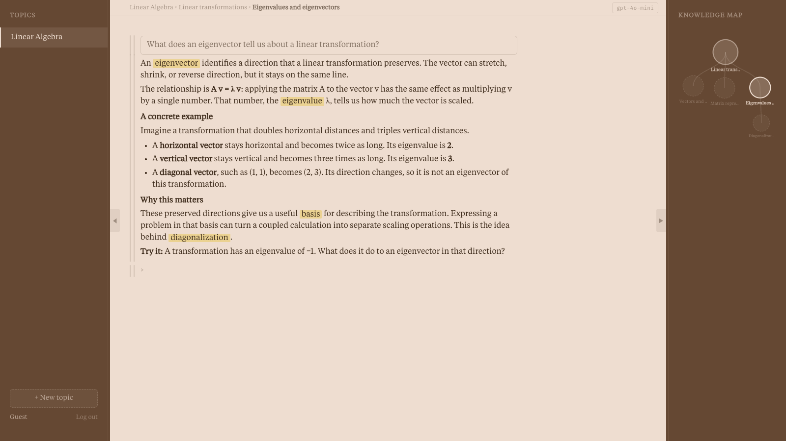

# Studium

A Flask learning workspace with courses, branching topic trees, saved conversations, and AI tutoring. Google OAuth handles sign-in, SQLite stores the workspace, and the OpenAI API generates tutoring responses.



*Example workspace populated with sample learning content.*

## Run locally

```sh
uv sync --locked
cp .env.example .env
uv run python app.py
```

Set the OpenAI API key, a persistent Flask secret, and your Google OAuth client credentials in `.env`. Register the callback implemented in `auth.py` with your OAuth application. The server prints its local address when started.

`app.py` defines the routes, `models.py` the SQLAlchemy models, `auth.py` sign-in, and `templates/` plus `static/` the interface. Local databases, environment files, and virtual environments are excluded from Git.

This is a prototype. The guest workspace was run locally and visually checked with sample content; live Google sign-in and AI calls were not exercised.
